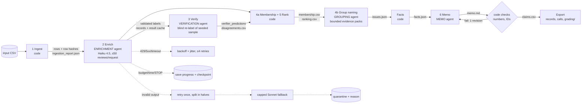

# Spotify review insight pipeline

This pipeline turns 660,622 Google Play reviews of the Spotify Android app (May 2022 – November 2023) into a traceable product recommendation: should next quarter's effort go to **access, usability, playback, or billing/support**?

Code owns record accounting, validation, caching, budgets and arithmetic. Four separate model roles (enrichment, verification, grouping and memo writing) handle the language work, and they hand off to each other only through saved, inspectable artifacts.

> **Status:** the code, prompts, labels, calculator, labeling tool and offline tests are complete. The paid runs (100-review pilot, 500, 10,000, golden set, full corpus) have **not** been executed yet. Every results section below is marked *pending* until real outputs exist. Nothing here is simulated evidence.

## Contents
1. [Setup](#setup) · 2. [Run it](#run-it) · 3. [Architecture](#architecture) · 4. [Labels and schema](#labels-and-schema) · 5. [Design choices](#design-choices) · 6. [Evidence map (rubric)](#evidence-map-rubric) · 7. [Limitations](#limitations)

## Setup

Requirements: [uv](https://docs.astral.sh/uv/), Python 3.12 or newer (uv installs it), and about 1 GB of free disk for the local SQLite state.

```bash
uv sync
```

**Data.** Download the course ZIP (link in bCourses) and unzip it into `data/raw/`. The raw CSV is not committed. Expected files and SHA-256 checksums:

| file | bytes | sha256 |
|---|---|---|
| `spotify_reviews_18months.csv` | 97,400,616 | `1fc85de68a304dd8978b537cfa58793d5f41cbaf417fa32cb53899f83a2fcef6` |
| `cost_100.csv` | 15,466 | `c884ac3b9be5066995d5063f96ad9af6e5e082975788c1684c4f6b6ea661dd0e` |
| `checkpoint_500.csv` | 76,170 | `a94e31663ee7b7eaa77e23b7a8425b530cc0c866ed5e714953172a0afef6a12f` |
| `analysis_10000.csv` | 1,477,793 | `eaa62ca6d44d717302904a9c922e99b0b4584d174309cb45295ecbc2ba2a91b5` |
| `golden_50_to_label.csv` | 7,905 | `1a125c3e509f58b0246ba16d0ea332675a53ffadb1928be4338a0bd7053a11c7` |

Source: BwandoWando, [3.4 Million Spotify Google Store Reviews](https://www.kaggle.com/datasets/bwandowando/3-4-million-spotify-google-store-reviews), version 2, CC0. Provenance check: running the supplied `prepare_dataset.py` on the Kaggle archive (sha256 `7b351f41…bc3cbc`) reproduced all five files and the manifest profile byte for byte. See [`evidence/provenance_rebuild_output.json`](evidence/provenance_rebuild_output.json).

**API key (paid commands only).** Copy `.env.example` to `.env` and set `ANTHROPIC_API_KEY`. `.env` is git-ignored. Offline commands never read it.

## Run it

Offline commands (no key, no model calls):

```bash
uv run pytest -q
```

```bash
python3 cost/calculator.py
```

```bash
uv run python -m pipeline status
```

```bash
uv run python -m pipeline rerank --records runs/full/records.jsonl --membership runs/full/membership.csv --out runs/full/ranking_rerun.csv --compare runs/full/ranking.csv
```

Paid commands (explicit; each enforces `--budget` in USD before admitting work):

```bash
uv run python -m pipeline smoke
```

```bash
uv run python cost/calculator.py run-pilot --budget 1.00
```

```bash
uv run python -m pipeline run --run-id dev500 --input data/raw/checkpoint_500.csv --budget 2 --workers 2
```

```bash
uv run python -m pipeline run --run-id full --input data/raw/spotify_reviews_18months.csv --budget 150 --workers 8
```

`run` accepts any CSV with the six source columns and executes ingest → enrich → verify → rank → group → memo → export. Re-running the same command resumes it: completed IDs are never sent again under unchanged settings. To stop gracefully, press Ctrl-C or create `runs/<run_id>/STOP`; in-flight calls finish and are saved. Add `--mode batch` to send enrichment through the Message Batches API at half price.

## Architecture



| stage | owner | input | output | failure behavior | stop condition |
|---|---|---|---|---|---|
| 1 Ingest | code | input CSV | SQLite rows (exact strings and contract row SHA-256), `ingestion_report.json`, `ingestion.json` | malformed CSV aborts; empty text → `quarantined: empty_review_text` | all rows read |
| 2 Enrich | Enrichment agent + code validator | pending distinct texts, ≤50 per request | `records` (completed/quarantined), `enrich_cache`, `calls` | invalid output retried once (whole-batch errors split into halves), then capped fallback, then quarantine with reason; transient errors back off up to 4 times; provider spend-limit or auth errors stop the run | no pending records, or budget/time cap, STOP file, or Ctrl-C |
| 3 Verify | Verification agent + code comparison | seeded sample of directly labeled texts (text only) | `verify/verifier_predictions.jsonl`, `disagreements.csv`, `verify_summary.json` | invalid items retried once, then recorded as verifier errors | sample done or a cap is reached |
| 4a/5 Rank | code | completed records | `membership.csv`, `ranking.csv`, `aggregates.csv`, `area_rollup.csv`, `trend_monthly.csv` | none (deterministic) | always completes |
| 4b Group naming | Grouping agent + code | one issue's 12-quote evidence pack with review IDs | `issues.json` (title, summary, coherence, misfit IDs) | IDs not in the pack are rejected; titles that are too long or summaries containing numbers trigger one retry, then the issue falls back to its taxonomy definition | one call per issue |
| 6 Memo | Memo agent + code checker | `facts.json`, top issues, ≤3 quotes per issue | `memo.md`, `claims.csv`, `claims_extra.csv`, `memo_checks.json` | unknown IDs, uncited numbers or mismatched numbers trigger one revision; persistent failure is saved as `checks_failed` for human review | checks pass or revision limit reached |

**Why a model at each model step, and what code does instead.** Topic, intent, severity and sentiment require reading messy, multilingual customer language, so the enrichment agent does that. Code does everything else: it deduplicates exact texts (484,189 of 660,609), extracts entities with an explicit feature lexicon (every entity is an exact substring, so none can be invented), uses the whole text as the quote for short reviews, and validates and repairs quotes so every `evidence_quote` is an exact source substring. The verifier exists to measure the enricher independently; it never sees the first answer. Grouping membership is pure code (`issue_id` = subtopic code); the grouping agent only names issues and flags misfits from bounded packs. The memo agent writes prose from saved aggregates and may only use numbers it cites from the facts table, and code checks every one.

## Labels and schema

The exact contract labels are `topic` ∈ {access, usability, playback, downloads, catalog, billing, support, other} and `intent` ∈ {cancellation, complaint, request, praise, unclear} (precedence order), with `severity` 1–5 on the shared scale. Definitions, 37 optional subtopics and the needs-review reasons live in [`labels/taxonomy.json`](labels/taxonomy.json). The enrichment prompt [`prompts/enrich_v1.md`](prompts/enrich_v1.md) adds 30 worked examples that apply the shared definitions; they are illustrative and none comes from the golden set.

A completed record follows the grading contract exactly:

```json
{"review_id":"…","source_sha256":"…","status":"completed","topic":"billing","intent":"complaint","sentiment":-1.0,"severity":3,"entities":["shuffle","premium"],"evidence_quote":"…exact substring…","needs_review":false,"label_config":"claude-haiku-4-5+enrich-v1+schema-v1+<prompt-hash>"}
```

`label_config` includes a hash of the rendered prompt, schema, model and sampling settings, so any change invalidates the result cache automatically. The richer internal record (`runs/<id>/enriched.jsonl`) also stores `subtopic`, `review_reason`, `quote_method`, rule adjustments, `result_source`, `source_request_id` and attempts.

## Design choices

- **Model:** `claude-haiku-4-5` for all four roles, at temperature 0 with no thinking, using structured outputs (JSON schema with enums). The fallback is `claude-sonnet-5-5` at effort `low`, used only for items that fail validation twice and capped at 0.2% of distinct texts. Prices are in [`config/rates.csv`](config/rates.csv), checked 2026-10-04 against the official pricing page.
- **Batching:** CSV parsing streams the file into SQLite; each request carries at most 50 reviews keyed `k=1..n`. Code maps keys back to source IDs and rejects missing, duplicate or foreign keys. The large instruction prefix is marked for prompt caching. The optional Message Batches transport halves the price and records job IDs, so an interrupted run collects the same jobs instead of resubmitting them.
- **Exact-text result cache:** keyed by `(sha256(text), label_config)`. One representative per distinct text is sent; every other ID keeps its own record with a direct `cache_source_id` and is counted separately in aggregates.
- **Severity guards in code:** complaint and cancellation records are at least 2; praise, request and unclear records are set to 1 and flagged `needs_review` (`rule_adjusted`). Every adjustment is logged in the record.
- **Spending controls:** before dispatch, the ledger reserves worst-case cost (uncached input estimate plus `max_tokens` output). Work is admitted only while spent + reserved + the next reservation stays within `--budget`. Provider spend-limit errors stop the run immediately. Timeouts are flagged `unknown_charge` for reconciliation.
- **Issues:** one issue per complaint or cancellation, with `issue_id` = subtopic (for example `billing.free_tier_limits`) and `allow_multi_issue=false`. Area rollups combine billing and support, as the business question does.

## Evidence map (rubric)

*Pending the paid runs; each row will link the saved artifact.*

| criterion | evidence |
|---|---|
| D1 accessible code/setup/artifacts | this README, `uv.lock`, `.env.example`, offline commands above |
| D2 architecture, shared schema, provenance | [Architecture](#architecture), `labels/taxonomy.json`, `label_config` hashes, `runs/*/run_summary.json`, provenance rebuild |
| D3 memo numbers ↔ calculations ↔ evidence | `runs/full/memo.md`, `claims.csv`, `claims_extra.csv`, `facts.json`, `memo_checks.json` — *pending* |
| D4 recommendation, alternatives, limitations | `runs/full/memo.md` — *pending* |
| T1 golden 50, per-field comparison, error analysis | `evals/golden_labeler.html` → `evals/golden_50_labeled.csv`; `evals/golden/` — *pending human labels* |
| T2 independent verification, planted errors, injection | `runs/full/verify/`, `evals/planted_errors.json`, `evals/injection/` — *pending* |
| T3 real cold/warm pilot, calculator, controls | `cost/` (offline calculator ready; pilot *pending*), `tests/test_pipeline.py` (offline failure injection: 11 passing) |
| W1 full ingestion, coverage, classification | `runs/full/ingestion_report.json`, `grading/`, self-check — *pending* |
| W2 staged program, bounded calls, resume | `pipeline/`, `runs/full/checkpoints/`, `grading/checkpoint_*.json`, recording — *pending* |
| W3 reproducible ranking, grounded output | `rerank` command, `runs/full/ranking.csv` — *pending* |

## Limitations

The data is self-selected public reviews: it has no revenue, plan tier or confirmed churn, cancellation language is stated intent rather than observed churn, timestamps have no timezone, and the first and last months are partial. Labels come from a small model and will be measured against 50 human labels and an independent verifier, so they are not ground truth. Exact-text reuse assumes identical text deserves an identical label. Results sections will report unresolved records and their effect on conclusions.
